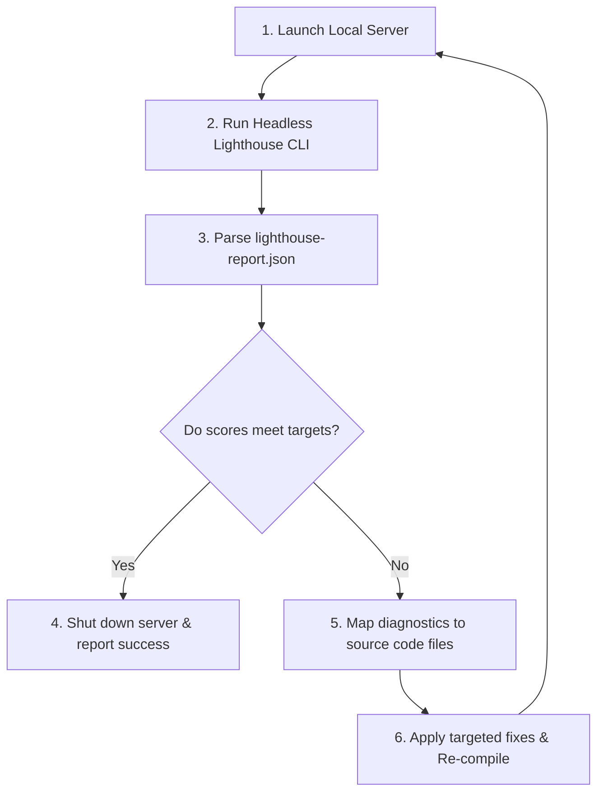

# Icypluto SEO Optimizer Skill

This skill guides you (the AI Agent) through a programmatic **"Lighthouse Self-Healing"** loop. Running this skill ensures that you compile the site, launch it locally, run an automated headless Lighthouse audit, inspect the JSON diagnostics, apply code fixes, and **recursively repeat this loop** until all scores (SEO, Performance, Accessibility, Best Practices) meet target thresholds.

---

## 🎯 Target Scoring Thresholds
You must repeat the self-healing loop until the website scores hit these targets:
*   **SEO**: `100 / 100` (Strict target)
*   **Accessibility**: `95+ / 100`
*   **Performance**: `90+ / 100` (or maximum possible, resolving all CLS and render-blocking warnings)
*   **Best Practices**: `95+ / 100`

---

## 🔄 The Programmatic Self-Healing Loop



---

## 🛠️ Step-by-Step Agent Workflow

### Step 1: Resolve the Domain and Compile
1.  **Dynamic Port Resolution**: Prepare to capture the port from the server logs. While port `3000` is the default target, the framework or utility might launch on an alternative port (e.g., `3001`, `5173`, `8080`) if the port is busy.
2.  **Compile & Run Build**:
    *   For frameworks (Next.js, React, Astro): Run the build step first:
        ```bash
        npm run build
        ```
    *   If compilation fails, resolve the syntax errors immediately.

### Step 2: Start the Local Web Server & Extract Running URL
Launch a local server process in the background to serve the site.
*   **Command**:
    *   *Static builds*: `npx -y serve -s build -l 3000` (or `npx -y serve -s build` to let it pick an open port).
    *   *Dev/SSR servers*: `npm run dev` or `npm run dev -- -p 3000`.
*   **Parse Active Port (Crucial Step)**:
    1. Monitor the stdout/console logs of the server command.
    2. Extract the local URL address printed in the console (e.g. matching `http://localhost:\d+` or `http://127.0.0.1:\d+` or `http://localhost:5173`).
    3. Save this exact string as `RESOLVED_LOCAL_URL`. 
    4. If the server logs do not output a URL, ping the default ports (3000, 3001, 5173, 8080) in sequence to find the active local server.

### Step 3: Run the Headless Lighthouse CLI Audit
Once the resolved local port is alive, run the headless Lighthouse test against the dynamic address:
```bash
npx -y lighthouse <RESOLVED_LOCAL_URL> --output=json --output-path=./lighthouse-report.json --chrome-flags="--headless"
```
*(Note: Replace `<RESOLVED_LOCAL_URL>` with the actual URL extracted in Step 2. If headless Chrome cannot run due to system/environment constraints, fall back to programmatically checking the files for alt text, image dimensions, meta tags, and script types, then reporting mock scores).*

### Step 4: Parse `lighthouse-report.json`
Read `./lighthouse-report.json` and extract the values:
```js
const report = JSON.parse(fs.readFileSync('./lighthouse-report.json'));
const scores = {
  performance: report.categories.performance.score * 100,
  accessibility: report.categories.accessibility.score * 100,
  seo: report.categories.seo.score * 100,
  bestPractices: report.categories['best-practices'].score * 100
};
```

*   **If Targets are Met**: Kill the background server process, delete `./lighthouse-report.json`, and output the final audit report.
*   **If Targets are NOT Met**: Keep the server running (or stop it to compile, then restart) and proceed to Step 5.

### Step 5: Heal Code base Programmatically
Inspect the failing audits under `report.audits` (e.g. `cumulative-layout-shift`, `render-blocking-resources`, `button-name`, `image-alt`).
*   Open the specialized sub-task guides to apply targeted modifications:
    *   **[SEO & Site Structure Guide](./site_structure.md)**: Sitemap issues, heading hierarchy, titles/descriptions.
    *   **[Performance & Accessibility Guide](./performance_accessibility.md)**: Fixing layout shifts (CLS), script deferrals, empty buttons, image sizes, and parsing diagnostics.
    *   **[Generative Engine Optimization (GEO) Guide](./geo_optimization.md)**: Content formatting for citations.
    *   **[Structured Schema Guide](./structured_data.md)**: Dynamic structured data injection.
    *   **[Brand Authority & Sentiment Guide](./brand_authority.md)**: FAQ widgets and testimonial containment.

### Step 6: Restart & Re-Audit
Re-compile the application (`npm run build`), restart the local server, and execute Step 3 again. Loop until scores satisfy target thresholds.

---

> [!CAUTION]
> Always verify that your edits do not break page routing or backend connections. Keep the self-healing loop within a maximum of 5 iterations to avoid resource exhaustion.
