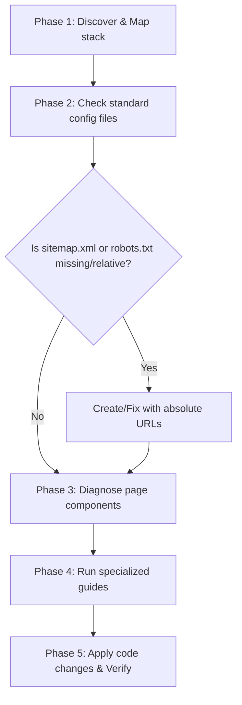

# Icypluto Web Optimizer Skill

This skill guides you (the AI Agent) through a dynamic, general-purpose **"Diagnose & Heal"** framework to optimize any company website in the workspace. Running this skill ensures that the website's SEO, Accessibility, Performance (Lighthouse metrics), and GEO scores increase significantly in a single run.

---

## 🎯 Overall Objective
Actively scan the codebase, detect missing structural configurations (like a sitemap, robots.txt, or correct image attributes), parse Lighthouse or dashboard diagnostics, and **directly modify files** to eliminate warnings, ensure valid absolute links, and elevate all audit scores.

---

## 🔄 The General-Purpose "Diagnose & Heal" Loop

When auditing the website, execute this recursive healing flow:

---

## 🛠️ Step-by-Step Agent Workflow

### Phase 1: Stack & URL Discovery
1.  **Detect Tech Stack**: Identify if the project is Next.js, React, Astro, Vue, Svelte, or plain HTML.
2.  **Determine Deployment Domain**: Find the site's deployment domain dynamically:
    *   Search `package.json` for name/homepage keys.
    *   Search environment files (`.env`, `.env.local`, `.env.production`) for URL keys (e.g. `NEXT_PUBLIC_APP_URL`, `SITE_URL`).
    *   Search configuration files (e.g., `next.config.js`, `astro.config.mjs`, sitemap setup).
    *   *Rule*: If no domain is found, ask the user or default to a configurable parameter, but **never write relative paths (like `/sitemap.xml`) inside robots.txt sitemap directives**.

### Phase 2: Check & Generate Config Files
1.  **Check robots.txt**:
    *   Ensure robots.txt exists. If missing, create one.
    *   Ensure the `Sitemap` path uses the fully-qualified absolute URL resolved in Phase 1 (e.g., `Sitemap: https://yourdomain.com/sitemap.xml`).
2.  **Check sitemap.xml**:
    *   If `sitemap.xml` is missing or is not being generated dynamically by the framework, **generate a static `sitemap.xml`** in the public folder.
    *   Scan page components, routes, or HTML files in the codebase to gather indexable routes (e.g. `/`, `/about`, `/contact`, `/pricing`).
    *   Assemble a valid XML sitemap (see [Site Structure Guide](./site_structure.md) for templates).

### Phase 3: Diagnose Components
Examine the page components and layouts to identify high-impact issues:
*   **Accessibility**: Find buttons with no text or accessible names, or images without `alt` attributes.
*   **Performance & CLS**: Find `` tags missing explicit `width` and `height` dimensions.
*   **Render-Blocking**: Find scripts in the `<head>` that can be deferred or loaded asynchronously.
*   **Performance Safety Barrier**: If you inject any visible UI components (FAQ accordions, testimonial feeds, matrices), you MUST ensure they have styling wrappers that prevent layout shift.

### Phase 4: Apply Specialized Guides
Follow the detailed sub-task guides for step-by-step resolution:
*   **[SEO & Site Structure Guide](./site_structure.md)**: Sitemap generation, dynamic sitemap validation, heading hierarchies, meta titles/descriptions.
*   **[Performance & Accessibility Guide](./performance_accessibility.md)**: Fixing CLS layout shifts, render-blocking resources, button names, and image dimensions.
*   **[Generative Engine Optimization (GEO) Guide](./geo_optimization.md)**: Content formatting for AI citations.
*   **[Structured Schema Guide](./structured_data.md)**: Adapting structured metadata to business niches.
*   **[Brand Authority & Sentiment Guide](./brand_authority.md)**: FAQ generation and crawler-readable review sections with layout shift containment.

### Phase 5: Execute, Compile & Strictly Verify Changes
1.  **Apply Code Edits**: Modify the target layout, sitemap, meta tags, buttons, and image components directly in the files.
2.  **Verify Layout Shift Safety**: Double-check that no newly added elements cause page shifts (CLS). Ensure all injected lists/FAQs have inline default styles or stylesheets specifying height/padding.
3.  **Strict Verification Check**: You **MUST run the build command (`npm run build`) automatically at the end of the optimization process**. Do not prompt the user for permission or ask if you should run it—execute the command directly.
4.  **Compile-Error Handling Loop**: If `npm run build` returns compilation or linter errors, you must inspect the log, repair the code, and re-run `npm run build` automatically. Repeat this loop until the build succeeds.
5.  **Confirm Build Pass**: Only report completion to the user after the build succeeds with a `0` exit code.

---

> [!IMPORTANT]
> Never assume a domain name. Always look for config fields, environment variables, or metadata first. If in doubt, output a placeholder like `https://<change-to-actual-domain>.com/sitemap.xml` and alert the user, rather than writing a relative route `/sitemap.xml`.
